<div align="center">

# Notion Bases for Obsidian

### The database engine Obsidian deserves

**6 views. 15 column types. Formulas, relations and lookups. Zero code required.**

Turn any folder into a Notion-style database with Table, Board (Kanban), Gallery, List, Calendar, and Timeline (Gantt) views — powered by plain Markdown and frontmatter. Your data stays yours, always.

[](https://github.com/bgarciamoura/obsidian-notion-bases-plugin/releases/latest)
[](https://obsidian.md)
[](LICENSE)
[](https://github.com/bgarciamoura/obsidian-notion-bases-plugin/releases)

[](https://github.com/bgarciamoura/obsidian-notion-bases-plugin/stargazers)
[](https://github.com/bgarciamoura/obsidian-notion-bases-plugin/issues)
[](CONTRIBUTING.md)

**[Website](https://bgarciamoura.github.io/obsidian-notion-bases-plugin/)** · **[Latest Release](https://github.com/bgarciamoura/obsidian-notion-bases-plugin/releases/latest)** · **[Report Bug](https://github.com/bgarciamoura/obsidian-notion-bases-plugin/issues/new?template=bug_report.yml)** · **[Request Feature](https://github.com/bgarciamoura/obsidian-notion-bases-plugin/issues/new?template=feature_request.yml)**

</div>

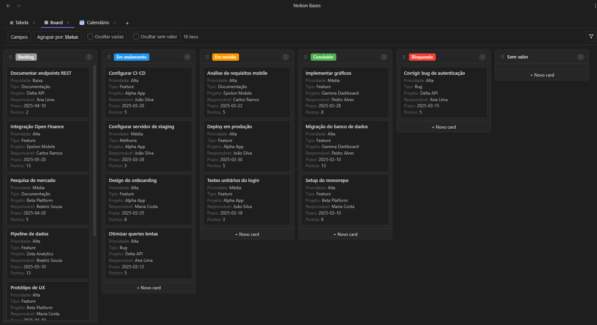

---

## Highlights

- **6 views** — Table, Board (Kanban), Gallery, List, Calendar, Timeline (Gantt)
- **15 column types** — Title, Text, Number, Select, Multi-select, Checkbox, Date, URL, Email, Phone, Status, Formula, Relation, Lookup, Image
- **Formula engine** — Spreadsheet-style functions: `IF`, `SUM`, `AVG`, `CONCAT`, `LEFT`, `ROUND`, and [many more](docs/formulas.md)
- **Relations & Lookups** — Link rows across databases and pull values from related notes
- **Advanced filters** — Type-aware operators with AND/OR logic
- **100% local Markdown** — Every row is a `.md` file, every column is a frontmatter field. No lock-in, no cloud, no telemetry

---

## Why Notion Bases?

Obsidian's built-in Bases plugin is great for tables and has its own expression-based formula system. Notion Bases focuses on a different set of trade-offs — more views, more column types, and a spreadsheet-style formula syntax.

### Views

| View | Notion Bases | Core Bases |
|------|:---:|:---:|
| Table | Yes | Yes |
| Board / Kanban | **Yes** | No |
| Gallery | **Yes** | No |
| List | Yes | Yes |
| Calendar | **Yes** | No |
| Timeline / Gantt | **Yes** | No |

> Notion Bases offers **4 exclusive views** that Core Bases doesn't have — Board, Gallery, Calendar, and Timeline — giving you the flexibility to visualize data the way that fits your workflow.

### Data modeling

| Feature | Notion Bases | Core Bases |
|---------|:---:|:---:|
| Column types | **15** | 6 |
| Formulas | Spreadsheet-style (`IF`, `SUM`, `AVG`, `CONCAT`) | Expression-based (JS-like) |
| Relation columns | **Yes** | No |
| Lookup columns | **Yes** | No |
| Image columns | **Rendered in cell** | Text only |
| Number formatting (prefix, suffix, decimals, thousands) | **Yes** | No |

> With relation and lookup columns, you can link databases together and pull values across notes — just like Notion. The spreadsheet-style formula syntax is familiar to anyone who has used Excel or Google Sheets.

### Table experience

| Feature | Notion Bases | Core Bases |
|---------|:---:|:---:|
| Column reordering (drag) | Yes | Yes |
| Column resizing (drag) | Yes | Yes |
| Column pinning | **Yes** | No |
| Row height options | Yes | Yes |
| Text wrap toggle | **Yes** | No |
| Aggregation row | **5 functions always visible** | Right-click → Summarize |
| Multi-column sort with priority | **Yes** | Basic sort |
| CSV import / export | **Yes** | No |
| Bulk actions (delete, duplicate, move) | **Yes** | No |

> Both plugins let you resize, reorder columns and adjust row height. Notion Bases goes further with **column pinning**, **text wrap**, a **persistent aggregation footer**, **multi-column sort with drag-to-reorder priority**, **CSV import/export**, and **bulk row actions**.

### Shared features

| Feature | Notion Bases | Core Bases |
|---------|:---:|:---:|
| Embed database in any note | Yes | Yes |
| Multiple views per database | Yes | Yes |
| AND/OR filter logic | Yes | Yes |
| 100% local Markdown | Yes | Yes |

**If you ever wished Obsidian had Notion-level databases without leaving your vault, this is it.**

---

## Views

### Table

A fully interactive spreadsheet: inline editing, resizable/reorderable/pinnable columns, aggregation footer, row height options, text wrap, multi-column sort, and bulk row actions.

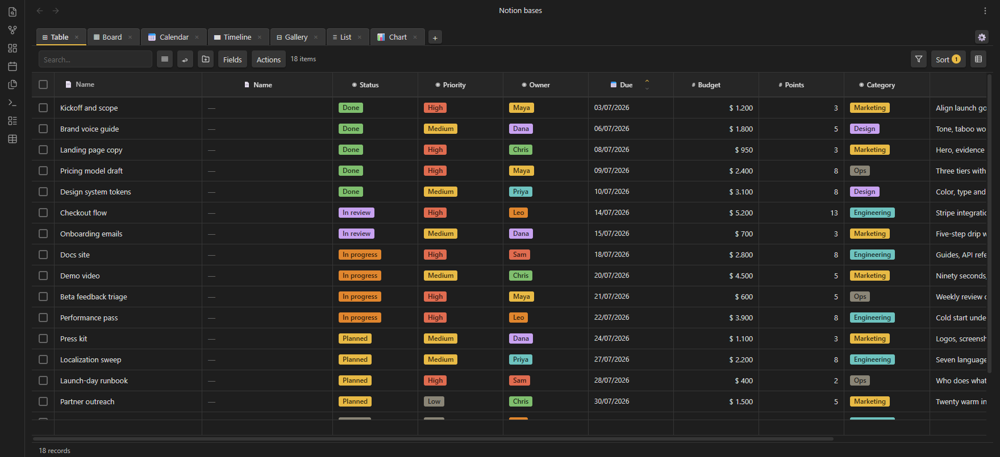

### Board (Kanban)

Drag cards between columns grouped by any `select` or `status` field. Add cards directly to a column. Hide empty or no-value columns. Configure which properties appear on each card.

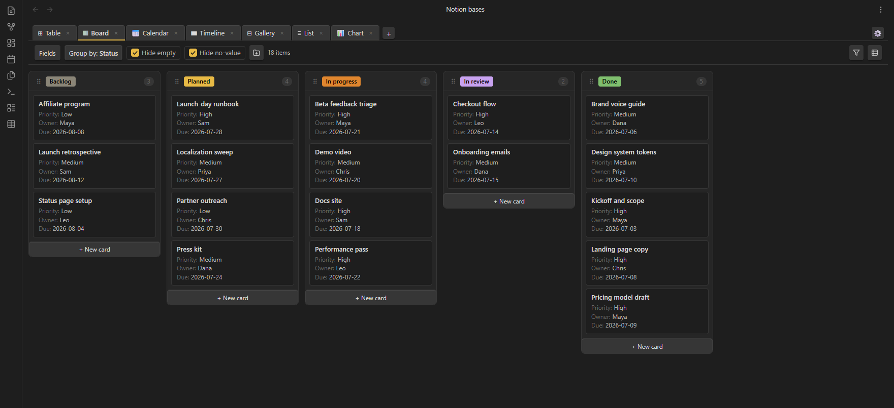

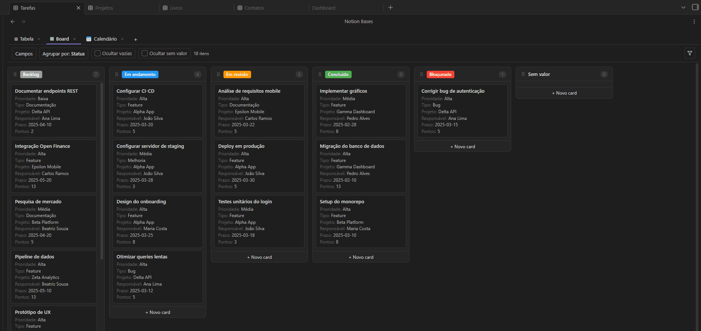

### Gallery

A responsive card grid. Pick a cover field, choose card size (small / medium / large), and display any properties below the title.

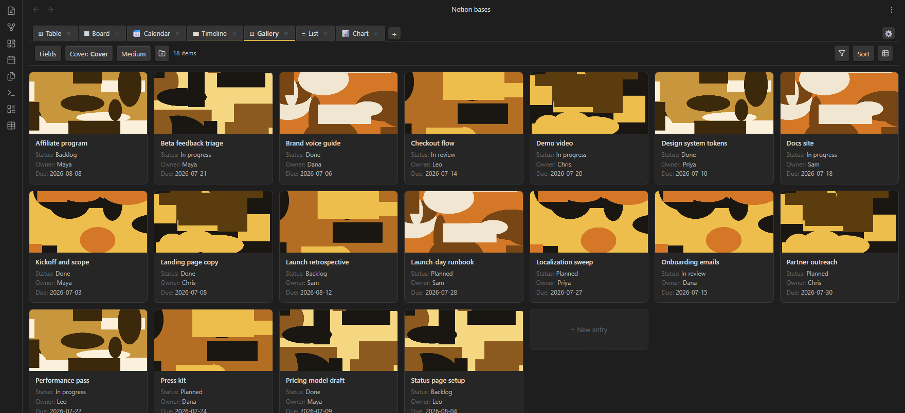

### List

A minimal, single-line view — title plus property chips. Great for quick overviews and task-oriented databases.

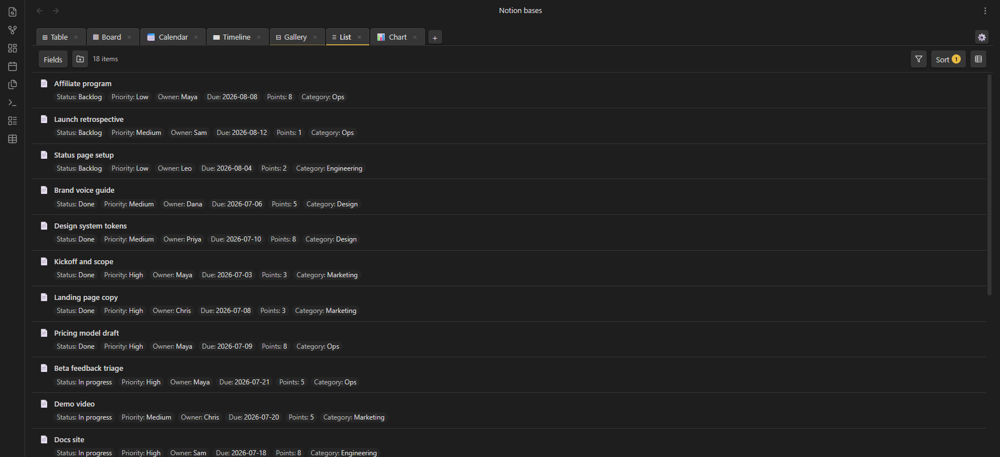

### Calendar

Monthly calendar. Position notes by any `date` field. Click a day to create a note with the date pre-filled. Notes without a date appear in a collapsible section.

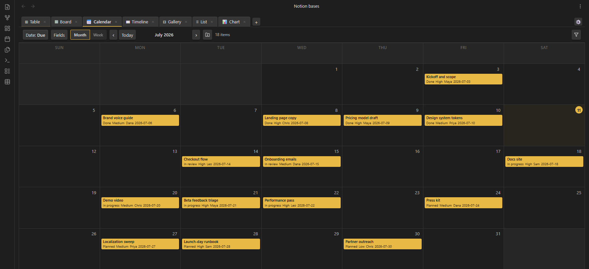

### Timeline (Gantt)

Horizontal bar chart with three zoom levels (days / weeks / months). Drag bar edges to resize start or end dates. Group rows by any field.


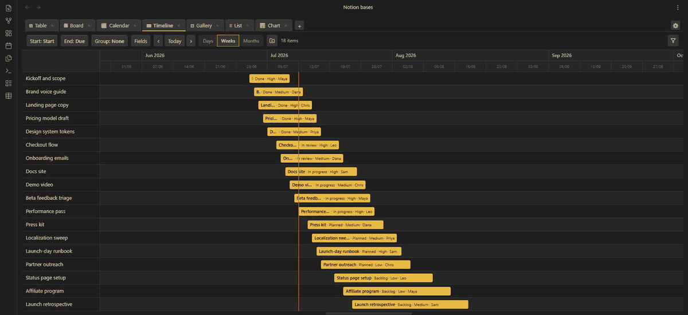

---

## Features

| Category | What you get |
|----------|-------------|
| **Column types** | Title, Text, Number, Select, Multi-select, Checkbox, Date, URL, Email, Phone, Status, Formula, Relation, Lookup, Image |
| **Formulas** | `IF`, `SUM`, `AVG`, `CONCAT`, `LEFT`, `ROUND` and [more](docs/formulas.md) |
| **Relations & Lookups** | Link rows across databases, pull values from related notes |
| **Filters** | Type-aware operators, AND/OR groups |
| **Sorts** | Multi-column with priority ordering |
| **Aggregation** | Sum, Average, Min, Max, Count — updates live |
| **Number formatting** | Prefix (`$`, `R$`), suffix (`%`, `kg`), decimals, thousands separator |
| **Column controls** | Pin, resize (drag), reorder (drag) |
| **CSV** | Import and export |
| **Bulk actions** | Select rows to delete, duplicate or move |
| **Schema inference** | Auto-detects column types from existing frontmatter |
| **Embeds** | Embed any database inside a note via code block |
| **Multi-view** | Each view has independent filters, sorts and field visibility |
| **100% Markdown** | Every row is a `.md` file. No lock-in, ever |

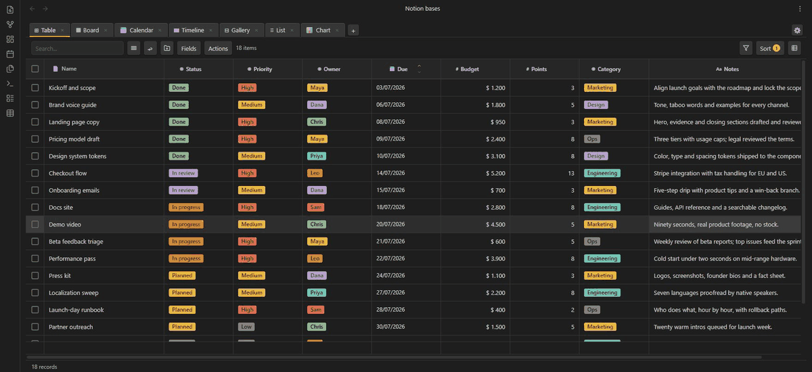

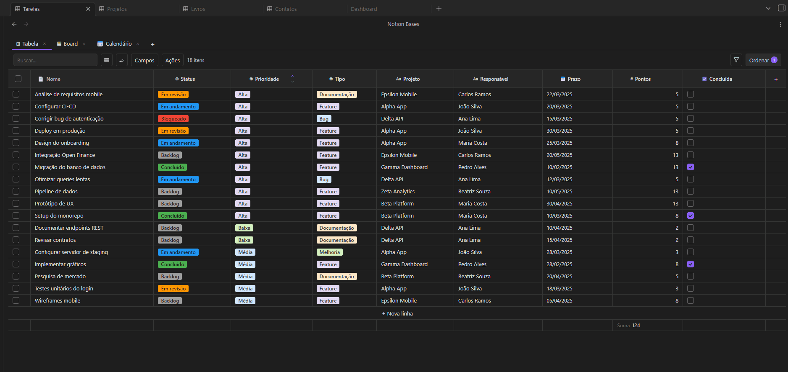

---

## Column types

| Type | Description |
|------|-------------|
| `title` | Note filename — always the first column |
| `text` | Plain text |
| `number` | Numeric value with optional formatting |
| `select` | Single option from a defined list |
| `multiselect` | Multiple options |
| `checkbox` | Boolean true / false |
| `date` | Date value |
| `url` | Clickable link |
| `email` | Email address |
| `phone` | Phone number |
| `status` | Colored badge with inline management |
| `formula` | Computed value from other columns |
| `relation` | Link to a note in another database |
| `lookup` | Pull a field from a related database |
| `image` | Display an image from the vault |

---

## Getting started

### Installation

> **Note:** Notion Bases is not yet available in Obsidian's Community Plugins directory. For now, use one of the methods below.

**Via BRAT (recommended)**

1. Install [BRAT](https://github.com/TfTHacker/obsidian42-brat) from Community Plugins
2. Open BRAT settings → **Add Beta plugin**
3. Paste: `bgarciamoura/obsidian-notion-bases-plugin`
4. Enable **Notion Bases** in **Settings → Community plugins**

**Manual installation**

1. Download `main.js`, `manifest.json` and `styles.css` from the [latest release](https://github.com/bgarciamoura/obsidian-notion-bases-plugin/releases/latest)
2. Create `<your-vault>/.obsidian/plugins/notion-bases/`
3. Copy the three files into it
4. Reload Obsidian and enable the plugin in **Settings → Community plugins**

### Create your first database

1. Open the command palette (`Ctrl/Cmd + P`) → **"Create new database"**
2. Pick a folder — a `_database.md` file marks it as a database
3. Click the table icon in the ribbon (or run **"Open database"**) to open it

### Add views

Click **+** in the view tab bar to add a new view. Each view has its own filters, sorts and field visibility. Drag tabs to reorder.

### Embed in a note

````markdown
```nb-database
path: Projects
```
````

Pin a fixed view type (no tabs):

````markdown
```nb-database
path: Projects
type: table
```
````

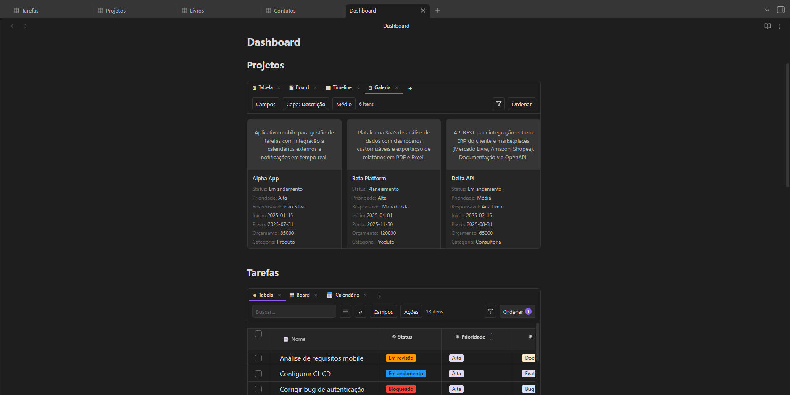

---

## How data is stored

Everything lives in your vault as plain Markdown:

| What | Where |
|------|-------|
| Rows | `.md` files in the database folder |
| Column values | Frontmatter fields in each note |
| Schema & view config | Frontmatter of `_database.md` |
| Embed view configs | Frontmatter of the hosting note |

Open any file in any text editor and your data is right there.

---

## Requirements

- Obsidian `1.4.0` or later
- Desktop and mobile supported

---

## Support the project

If Notion Bases makes your vault more powerful, consider supporting development:

<div align="center">

[](https://github.com/sponsors/bgarciamoura)
[](https://buymeacoffee.com/bgarciamoura)

</div>

---

## Contributing

Contributions are welcome! Please read the [Contributing Guide](CONTRIBUTING.md) before submitting a pull request.

For bugs and feature requests, use the [issue tracker](https://github.com/bgarciamoura/obsidian-notion-bases-plugin/issues).

---

## License

[GPL v3](LICENSE) — free to use and modify, but any distribution must remain open source under the same license.
